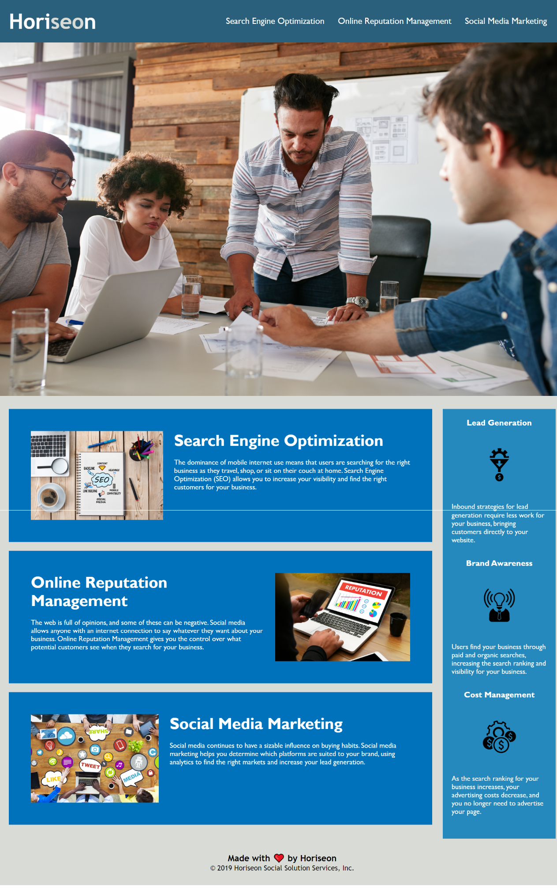

# Horiseon 

## Description

*My motivation in completing this project was to learn how to apply concepts we learned in class and gain experience. 

*I built this project because I wanted the code to be easier to read and more accessible while keeping the formatting the same. 

*The problems solved while working on this project were adding semantic elements, arranging elements to follow a logical structure, consolidating the CSS, adding accessible alt attributes, giving the page a proper title, correcting a page link, and inserting CSS comments.

*Through this project I learned how to link a section of page to the nav bar, how to correctly link image files, how to take a full-page scrolling screenshot, how to commit changes to GitHub, and how to make the website live.

*My project may stand out because I tried to increase the efficiency of the CSS by organizing them to follow the semantic structure of the HTML elements and included comments. 

*I faced a challenge with getting the cover photo linked to the HTML instead of the CSS. I couldn't copy and paste it over. I had to find the image's relative path. I faced a similar challenge again when I put a space in the name of my screenshot, and it wouldn't appear on this README file. I am also learning that multiple codes can do the same thing. I am faced with the challenge of trying to learn which ways are better and why. 

*Features I would like to implement in the future would be to insert a video, contact information for the company, and a 'Ask a Question' form. 

## Website Appearance

## Link to Application
Horiseon Website: https://srandall1213.github.io/Horiseon/

